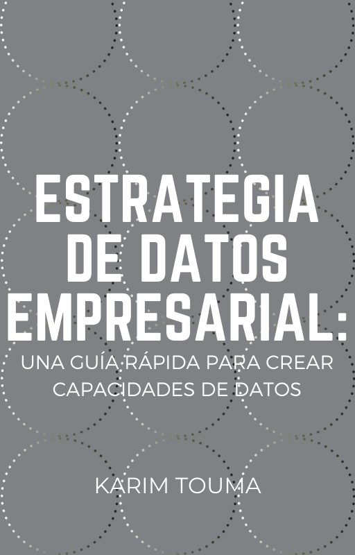

# Estrategia de datos empresarial

Estrategia de datos empresarial

Copyright © 2020 [Karim Touma](http://karim.touma.io).

## Publicacion

El libro puede ser descargado por completo como PDF desde este repositorio:  
[estrategia_de_datos_preview.pdf](estrategiadedatos-preview.pdf)

Para una mejor experiencia de lectura, tambien se encuentra disponible en: [Leanpub](https://leanpub.com/estrategiadedatos)

## Contribuir

Todo este contenido se libera completamente opensource, tanto las imágenes como el contenido, si quieres colaborar puedes contribuir mediante requests a este código fuente.

## Tabla de contenidos

ISBN 978-956-401-937-6

* [1. Introducción](manuscript/01_introduccion.md)
* [2. Evaluación](manuscript/02_evaluacion.md)
* [3. Definición de Estrategia](manuscript/03_definicion.md)
* [4. Estrategia táctico-fundacional](manuscript/04_estrategia_tf.md)
  * [4.1. Equipo táctico: la fábrica de casos de uso](manuscript/04_1_equipo_tactico.md)
  * [4.2. Equipo fundacional: las bases tecnológicas y la gobernanza de los datos](manuscript/04_2_equipo_fundacional.md)
  * [4.3 Un modelo de evolución](manuscript/04_3_evolucion.md)
* [5. Gestión del conocimiento](manuscript/05_gestion_conocimiento.md)
  * [5.1. Empresarial: gobierno de datos](manuscript/05_1_empresarial.md)
  * [5.2. Equipos: ciencia de datos](manuscript/05_2_equipos.md)
* [6. Gestión de los equipos](manuscript/06_equipos.md)
  * [6.1. Configuración de Equipos](manuscript/06_1_configuracion.md)
  * [6.2. Evolución y desarrollo de plan de carrera](manuscript/06_2_evolucion.md)
  * [6.3. Agilidad en equipos de datos](manuscript/06_3_agilidad.md)
* [7. Tecnología](manuscript/07_tecnologia.md)
  * [7.1. Diferenciar inversiones en tecnología](manuscript/07_1_inversiones.md)
  * [7.2. Estrategia de adopción](manuscript/07_2_adopcion.md)
* [8. Principales puntos de dolor](manuscript/08_puntos.md)
  * [8.1. Calidad de datos](manuscript/08_1_calidad.md)
  * [8.2. Como encarar un problema de ciencia de datos](manuscript/08_2_cienciadatos.md)
  * [8.3. Cultura](manuscript/08_3_cultura.md)
* [9. Conclusiones y cómo retroalimentar la estrategia](manuscript/09_conclusiones.md)

