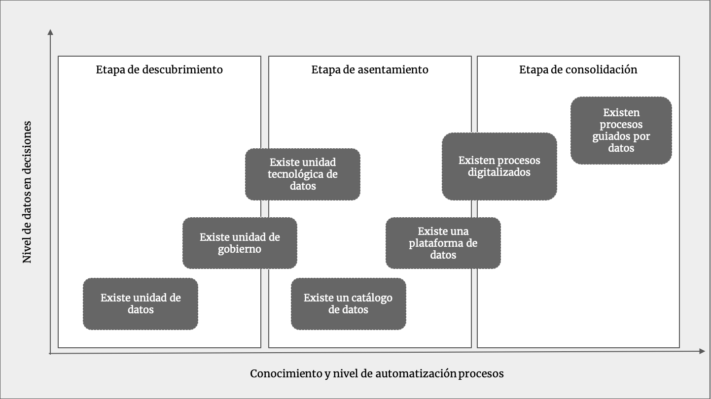

## 4.3. Un modelo de evolución

La evolución de esta estrategia considera tres grandes estados y sus correspondientes evoluciones: la etapa de descubrimiento, la etapa de asentamiento, y la etapa de consolidación. En los que tanto la configuración de los roles como los diferentes tipos de actitudes y aptitudes dentro de los equipos, varían diametralmente. En esta sección analizaremos las principales características de estos tres diferentes estados y sus consecuencias en el plan de largo plazo de las competencias de datos al interior de cualquier compañía.

*Figura 6. Principales etapas de madurez y algunos hitos referenciales.*

* Etapa de descubrimiento: para incrementar el impacto de los conquistadores, el equipo táctico se configura con un agregado de expertos de negocio y facilitadores técnicos del interior de la compañía, enriqueciendo con conocimiento de negocio y prioridades a los profesionales del área de datos. En esta etapa también es posible considerar ayuda de recursos externos de consultoría las capacidades avanzadas de modelamiento matemático o tecnología. 
Como se desarrolló en secciones anteriores, el equipo táctico es el protagonista de la evolución de la gestión con datos, tomando un contexto completo y mejorándolo a través de información y tecnología. Los focos en la etapa de descubrimiento son configurar las puntas de lanza y empoderar a los equipos con un sentido de urgencia por aprender de las problemáticas y configurar el medio para testear las hipótesis. Los perfiles en esta etapa deben considerar orientación al cambio, empoderamiento interno y redes de contacto con las áreas claves al interior de la compañía.

* Etapa de asentamiento: una vez planificada la captura de valor por la de exploración, es necesario sentar las bases de la transformación. En la etapa de asentamiento, deben ingresar los perfiles de construcción, así como los primeros planificadores, lo que incluye conceptos de tecnología de la información, para diseñar la evolución mediante metodologías de arquitectura empresarial. También es una buena oportunidad para asesorarse con empresas con experiencia en aceleración digital para aprovechar las experiencias. 
En esta etapa debe ponerse foco en capturar perfiles con experiencia en el mercado, que servirán como semilleros de la configuración futura de los equipos. Se requiere comenzar a desarrollar las metodologías de contratación y configuración de planes de carrera. El principal foco en la etapa de asentamiento es generar robustez al equipo de datos al interior de la compañía, mediante la contratación de expertos y consolidación de las capacidades tecnológicas.

* Etapa de Consolidación: las capacidades de datos en esta etapa se consideran maduradas al interior de la fábrica y el equipo táctico por lo que el principal foco en la consolidación es salir del modo proyecto y dotar a la organización completa con un enfoque de solución de problemas más orientado a datos. En pos de dotar con esta capacidad a la organización, es necesario permear a la capa directiva con conocimientos de base, como los son el método científico, estadística e ingeniería de software. En el sentido de percibir las nuevas capacidades y estar atento en como embeberlas en la organización. 
Los perfiles en esta etapa comienzan por interiorizarse en la organización como un todo, desplegando las habilidades de desarrollo desde el mundo de los datos hacia las demás áreas de tecnología, mientras que por el lado de casos de uso, estos adoptan nuevas responsabilidades y pueden o no depender funcionalmente de otras áreas más cercanas a la captura de valor. La evolución natural de este equipo es involucrarse en las capacidades de la compañía. De otra forma, la escalabilidad de la adopción de datos no podrá tomar presencia transversal en la compañía, por ende, estará destinada a vivir en un alcance limitado.

Estas tres diferentes etapas, claramente deben ser adaptadas a la estrategia de negocios y a la estrategia tecnológica del negocio, por lo que pueden sufrir modificaciones, una particularidad relevante son los liderazgos de estas áreas, en donde abordaremos mayor profundidad en el capítulo 6.
