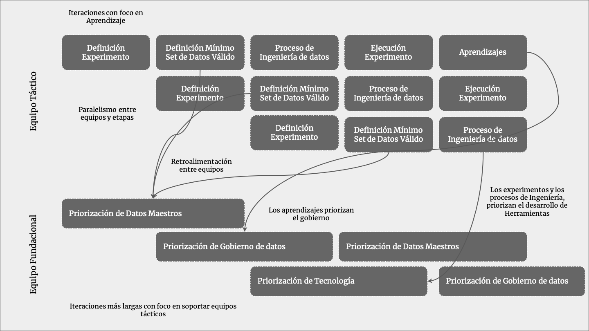

## 6.3. Agilidad en equipos de datos

Una buena alternativa para la gestión de proyectos de datos es involucrar metodologías ágiles, tomando principalmente las máximas de empoderamiento en la toma de decisiones y la conformación de equipos interrelacionados, en los cuales las diferentes áreas enriquezcan, mediante el interrelacionamiento de conocimiento, la operación y creación de nuevo conocimiento-fin máximo de los equipos de datos. 

*Figura 10. Esquematización de los diferentes ciclos de trabajo, tanto en los equipos tácticos y cómo estos realimentan la estrategia fundacional.*

La agilidad en equipos de datos no es construir más rápido, sino aprender cada vez más rápido, en el sentido en que el aprendizaje de forma -robusta- sea logrado cada vez con menos iteraciones de validación o incertezas, tomando la experiencia de la creación de conocimiento científico y la epistemología, mientras se construyan bases firmes de conocimiento, cada vez será más sencillo construir nuevas teorías sobre las nuevas hipótesis. Una construcción colaborativa de hipótesis validadas no es un compendio de axiomas, por ende, los mecanismos de revisita de este conocimiento adquirido debe considerarse una nueva capacidad. Esta cualidad de la ciencia de datos puede parecer contraintuitiva, pero por el contrario, enfoca el fin último de los equipos y la importancia de estos, dado que el objetivo no es construir una batería de teorías, sino más bien, un músculo (equipo) aceitado (con tecnología) que esté orientado a encontrar y explotar oportunidades, mientras constantemente se revisan las hipótesis que estén dejando de reportar valor de negocio.

