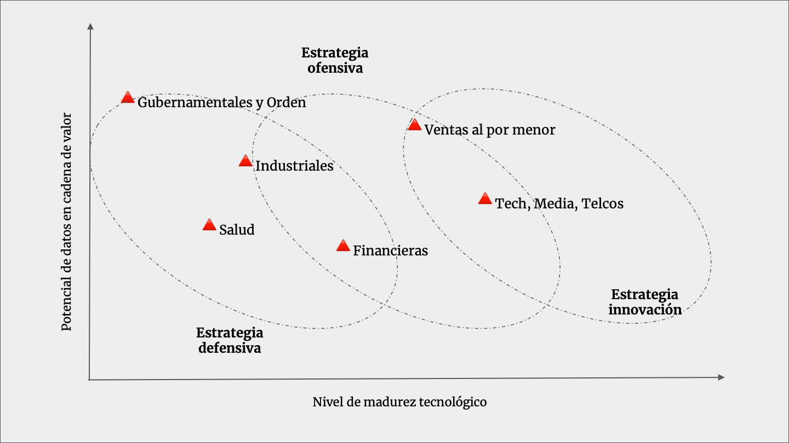

# 3. Definición de Estrategia

La estrategia de datos considera la definición, abordaje, así como consideraciones técnicas y funcionales. Para simplificar este despliegue, es necesario diseñar la evolución, creación o consolidación de las capacidades de datos para la empresa, lo que abordaremos en este capítulo. La primera gran pregunta -¿cuál es el dolor que va a atacar la estrategia?- divide a las empresas en dos grandes agrupaciones: empresas con estrategias de datos defensivas y ofensivas. Posterior a la evaluación, sería posible encasillar el modo en función a las características del negocio, nivel de competitividad y nivel de madurez tecnológico, incluso la evaluación de contextos dentro de mundos complejos. Luego, a esta definición es necesario definir los roles de liderazgo necesarios para empujar cada estrategia, en donde las capacidades de datos se deben mezclar con el conocimiento al interior de la compañía.

Para simplificar la infinita variedad de posibles diseños, los englobamos en tres grandes grupos Se definirán sus principales características, para que el lector defina cuál se adecua mejor a su realidad y posteriormente, a través de los siguientes capítulos, definir en qué partes relajará o altera su ejecución y profundidad. Las estrategias no son mutuamente excluyentes ni exhaustivamente complementarias, es decir, debe considerarse que la estrategia es el pilar que sostiene la evolución, pero no el camino que traza el rumbo, las competencias son complementarias.

*Figura 3. Diferentes estrategias y su adaptación al contexto industria.*

* Estrategia Defensiva: en esta estrategia, lo primordial es utilizar los datos para asegurar la sostenibilidad del negocio, en modelos que dependen fuertemente de regulación, normativa o seguridad de la información. El foco en esta estrategia es construir capacidades de seguimiento exhaustivo de activos de datos a través de mecanismos de arquitectura, gobernanza y sistemas de información, es una metodología basada en procesos, con poco espacio para innovación o diferenciación. Por lo general esta estrategia se ocupa para empresas con alto riesgo de operación como alta industria, minería, gas, y alta intensidad de gastos de capital. En empresas en donde los datos tienen implicancias regulatorias esta estrategia puede ser la manera de ejecutar gobierno, pero no quiere decir que se obvien las innovaciones o analítica avanzada, existen problemáticas defensivas que si requieren modelos de machine learning, es decir, donde la madurez de las soluciones no recoge todas las implicancias. Esto quiere decir que muchas veces las dificultades pueden ser abordadas mediante soluciones analíticas cuando una metodología existente no contiene soluciones para problemas propios de gestión, manejo y consistencia de datos.

* Estrategia Ofensiva: considera una orientación pragmática donde el valor de los datos se construye mediante iteraciones de aplicaciones de datos en el negocio. La mejora operacional, optimización de mercadeo, reducción de gastos, mejora en las inversiones, son algunas de las verticales de ataque, en las que todos los objetivos de desarrollo están pragmáticamente orientados a mejorar los resultados de negocio de la compañía. Puede resultar compleja esta estrategia si no existen, o están en construcción, las capacidades para monetizar los nuevos activos de datos que los equipos de datos construyan, por lo tanto, en una estrategia ofensiva es necesario considerar mayores prerrequisitos en su establecimiento, dado que los focos de ataque pueden ser tan variados o complejos como los focos de la matriz. Por eso, muchas veces es necesario compensar o sobreinvertir en la aceleración de la compañía como un todo.

* Estrategia de Innovación: esta estrategia resulta ser útil para organizaciones grandes que poseen dificultades para formar nuevas capacidades dada su inercia, tamaño y extrema complejidad. Se encuentra frecuentemente en adquisiciones de empresas especializadas, creación de innovación interempresa, formación de centros de competencias o centros de investigación y desarrollo. Las formas de ejecución pueden ser variadas, pero se caracterizan por no seguir los lineamientos de la corporación y trazar, definir y especificar claramente en un inicio del proyecto las problemáticas en donde trabajar. Es una estrategia muy útil para modernizar la operación de la compañía como un todo, e incluso, probar soluciones que puedan tener un riesgo reputacional o regulatorio para la compañía madre. Es un concepto en el que los equipos de datos se mueven como una start-up, con el presupuesto de una gran compañía y en el que la orientación puede o no tener relación con los objetivos de la compañía. Por lo general, hay una mayor probabilidad de que sobreviva si los objetivos se alinean, pero no es un requerimiento en su formación.

Las estrategias deben considerarse centroides y no limitaciones, pues se pueden enmarcar mediante un fin, o mediante las restricciones organizacionales, pero son altamente variables en su configuración, tanto en el transcurso como en la vida de los equipos, en el estado del mercado o en el estado general de la organización. Lograr definir un foco y luego construir las capacidades para ganar flexibilidad es crítico considerando el estado de madurez de las capacidades y tecnologías ligadas al mundo de los datos, tópicos que esperamos aclarar en el transcurso de los siguientes capítulos.
